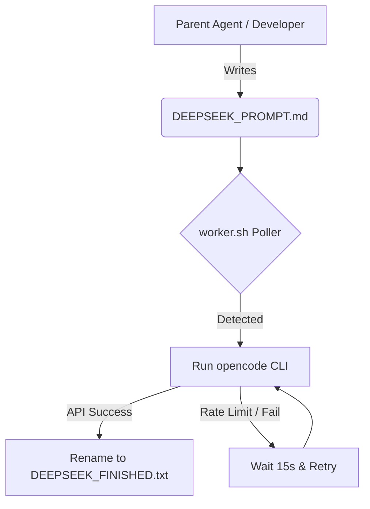

# OpenCode Delegation & Agent Worker Pipeline Guide

This document explains the autonomous coding workflow setup used in this project. It details how the `worker.sh` script coordinates task delegation to `opencode` and how you can replicate it in other plugin projects.

---

## 1. Pipeline Overview

The delegation pipeline allows a developer or parent agent to enqueue complex programming tasks into the workspace. A local runner picks up the task, invokes an external AI agent via `opencode` to perform the edits, handles network retries, and records the completion status.



---

## 2. Requirements & Setup

To replicate this workflow in another plugin project, you need:

1. **`opencode` CLI**: The command-line utility installed on your local host system.
2. **Bash Shell Environment**: Standard terminal tools (MacOS/Linux).
3. **The Worker Script**: A local execution script (`worker.sh`) placed in your project root.

---

## 3. The Worker Script (`worker.sh`)

Create a script named `worker.sh` in the root of the target project directory.

```bash
#!/bin/bash

# Configuration
PROMPT_FILE="DEEPSEEK_PROMPT.md"
FINISHED_FILE="DEEPSEEK_FINISHED.txt"
POLL_INTERVAL=10
RETRY_INTERVAL=15

echo "Starting OpenCode Agent Worker loop..."
echo "Polling for ${PROMPT_FILE} every ${POLL_INTERVAL} seconds..."

while true; do
  if [ -f "$PROMPT_FILE" ]; then
     echo "New task detected in ${PROMPT_FILE}! Delegating to OpenCode..."
     
     # Automatically retry if the API is overloaded or experiences traffic errors
     until yes | opencode run "Please read ${PROMPT_FILE} and execute its instructions to modify this plugin." < /dev/null; do
         echo "OpenCode/DeepSeek API returned an error. Retrying in ${RETRY_INTERVAL} seconds..."
         sleep $RETRY_INTERVAL
     done
     
     # Mark task as finished
     mv "$PROMPT_FILE" "$FINISHED_FILE"
     echo "Task completed successfully. Marked as finished."
  fi
  sleep $POLL_INTERVAL
done
```

Make the script executable:
```bash
chmod +x worker.sh
```

---

## 4. How to Use the Pipeline

1. **Start the Worker:** Run the script in your terminal inside the project folder:
   ```bash
   ./worker.sh
   ```
2. **Submit a Task:** Write a markdown file named `DEEPSEEK_PROMPT.md` in the root directory specifying the changes you need (e.g., "Add a check for validation filter, modify settings page").
3. **Observe Execution:** The script will detect the file, trigger `opencode`, and automatically retry if the API rate-limits.
4. **Completion:** When the subagent finishes modifying the codebase, the file is renamed to `DEEPSEEK_FINISHED.txt`.
